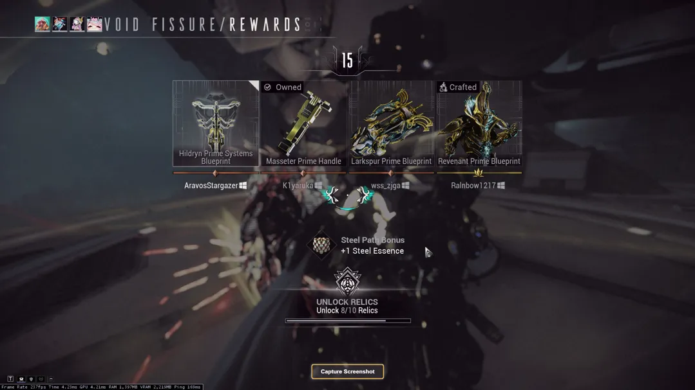
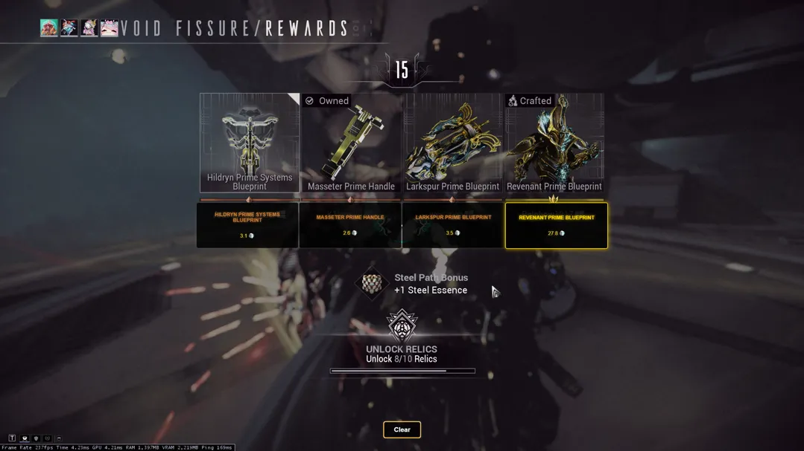
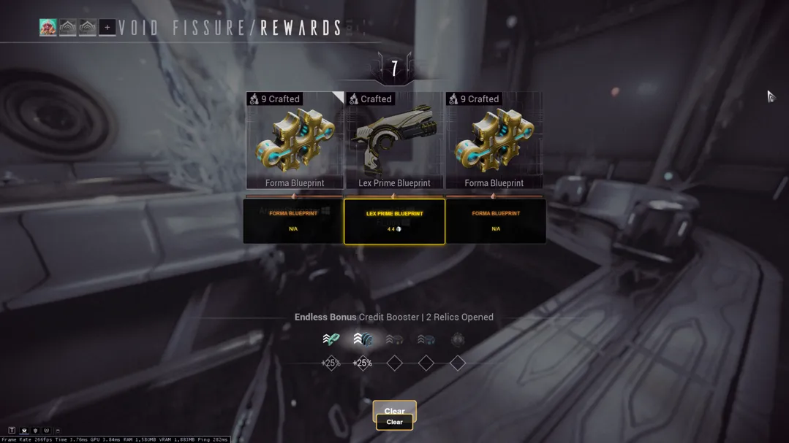
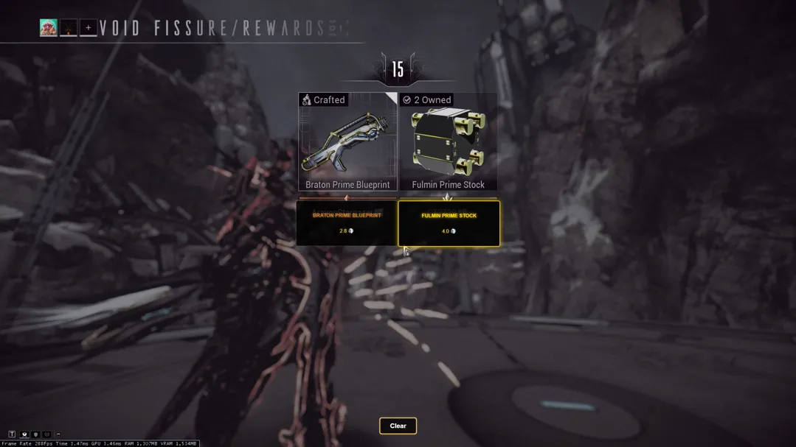
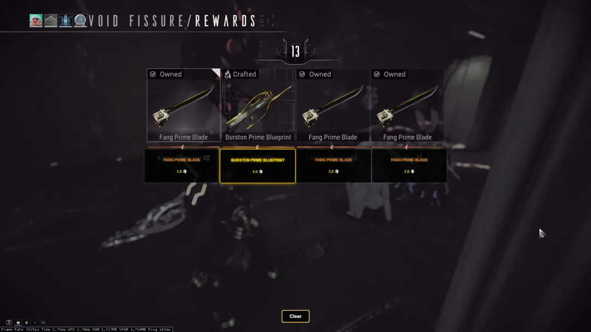

<h1>
  
  Warframe Relic Runner
</h1>

**Warframe Relic Runner** is an overlay tool for Warframe that quickly evaluates the average Platinum value of relic rewards, making it easier to decide which Prime Part to select.


---

## ✨ Features

- 📸 **Screenshot Capture:** Captures a screenshot when you crack open a relic.
- 🔍 **OCR Extraction:** Uses Tesseract.js to automatically detect and parse Prime part text.
- 💰 **Market Price Lookup:** Fetches average market values from Warframe Market.
- 💾 **Local DB Caching:** Implements local SQLite caching with bulk updates to reduce relic lookup times from 5–10 seconds to under 1 second.
- ✅ **Informed Decision Making:** Shows Prime Part values on-screen to help you choose the best reward.
- 👥 **Team Support:** Works in solo play or teams of 1–4 players.
- ⭐ **High-Value Relic Highlighting:** Highlights the most valuable relic reward in gold, with others in bronze.
- ⚖ **TOS Friendly:** Captures screenshots without reading game memory, ensuring compliance with Warframe’s Terms of Service.
- 🖥 **Automatic Capture:** Automatically captures relic rewards eliminating the need for manual adjustments.

---

## 🛠 Installation & Setup

### 🔽 Clone the Repository
```sh
git clone https://github.com/Aravos/Warframe-RelicRunner.git
cd Warframe-RelicRunner
```

### 📦 Install Dependencies
```sh
npm install
```

### ▶ Run the Application
```sh
npm run
```

---

## 🎮 Usage Guide

1. **Launch Warframe** as usual.
2. **Open the overlay application.**
3. Wait a few minutes while the application updates prices 💾 (this update occurs once a day).
4. The overlay **automatically** captures relic rewards, so there’s no need to adjust the screen area.
5. When you crack open a relic, click **Capture Screenshot** in the overlay.
6. **Choose the Prime Part** based on the displayed Platinum value.
7. **Highest Value Indication:** The most valuable Prime part is highlighted in golden text; other relic rewards appear in bronze.
8. Click **Clear** to reset the overlay.
9. Repeat steps 5–8 for each run.
---

<table>
  <tr>
    <th style="text-align:center;">Overlay</th>
    <th style="text-align:center;">Four Squad Prime Selection</th>
  </tr>
  <tr>
    <td></td>
    <td></td>
  </tr>
</table>

<table>
  <tr>
    <th style="text-align:center;">Three Squad</th>
    <th style="text-align:center;">Two Squad</th>
  </tr>
  <tr>
    <td></td>
    <td></td>
  </tr>
</table>

<table>
  <tr>
    <th style="text-align:center;">Duplicate Rewards</th>
  </tr>
  <tr>
    <td></td>
  </tr>
</table>

---
## 🔧 Technologies Used
- ⚡ **Electron.js** – For creating the overlay.
- 🧠 **Tesseract.js** – For Optical Character Recognition (OCR).
- 🖼 **Sharp** – For image processing.
- 🌐 **Node.js** – Backend processing and file system access.
- 💾 **SQLite:** For local caching and efficient bulk updates.
- 📊 **Warframe Market API** – Fetching real-time Platinum prices.
- 🎨 **HTML, CSS, JavaScript** – Frontend design and user interaction.

---

## 📜 License
This project is licensed under the **MIT License**.
