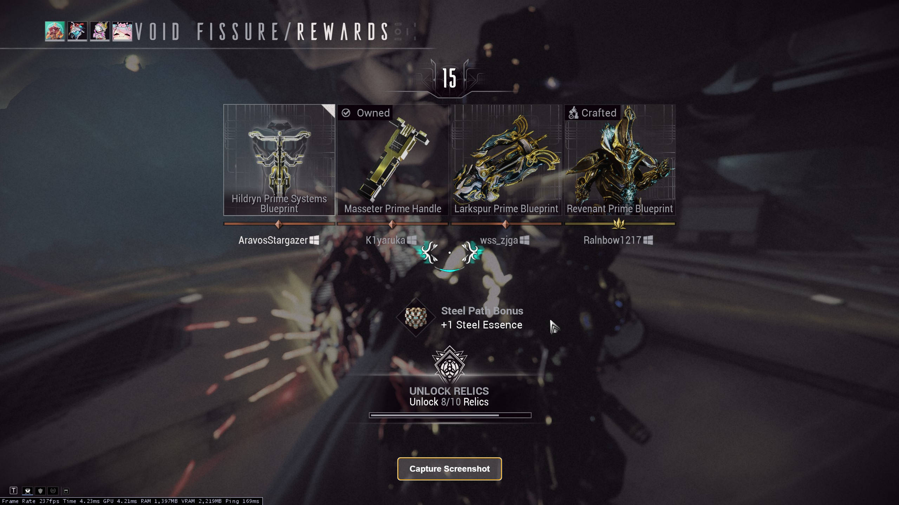
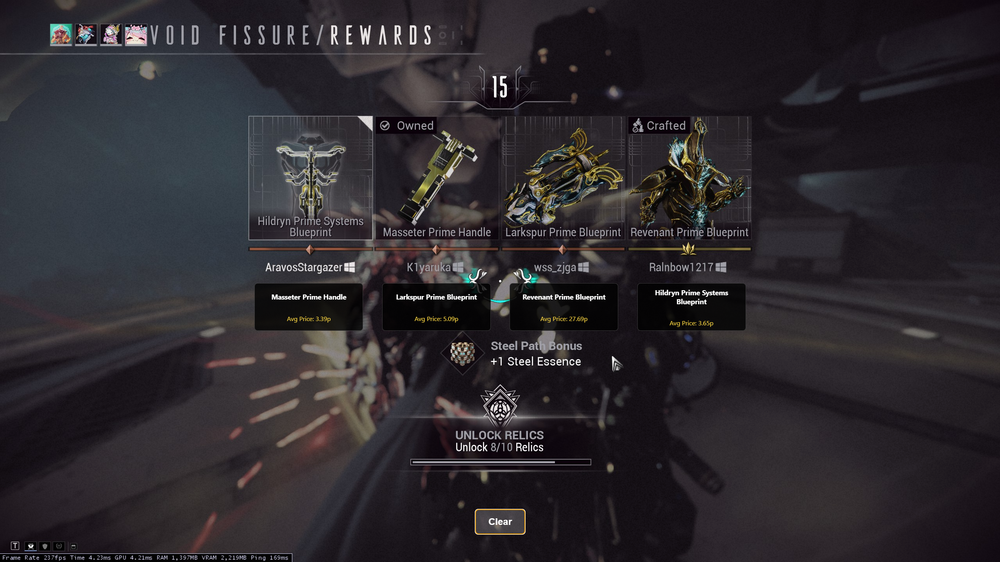
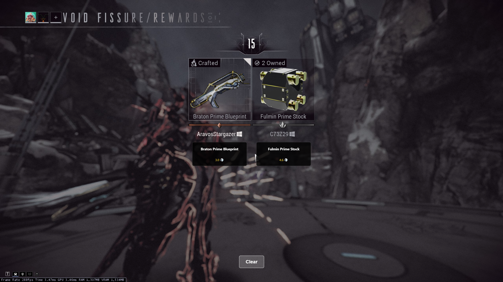
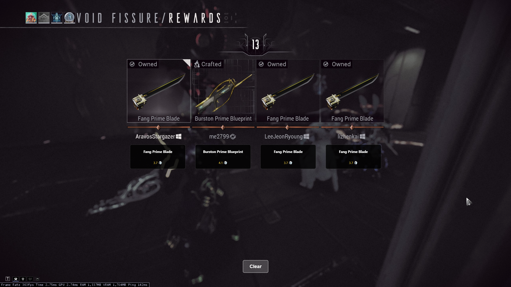

# WF GarbageGauge

WF GarbageGauge is an overlay tool for Warframe that helps you quickly evaluate the average Platinum value of relic rewards, making it easier to decide which Prime part to select.

## Features
- Captures a screenshot of your game when you crack open a relic.
- Extracts text using OCR to identify Prime parts.
- Fetches the average market value of the Prime parts from Warframe Market.
- Displays the part values on-screen, allowing you to make informed decisions.
- Works for solo play or in teams of 1-4 players.

## Installation & Setup
### Clone the repository
```sh
git clone https://github.com/Aravos/WF-GarbageGauge.git
cd WF-GarbageGauge
```

### Install dependencies
```sh
npm install
```

### Run the application
```sh
npm run
```

## Usage
1. Launch Warframe normally.
2. Open the overlay application.
3. When you crack open a relic, switch to the overlay and click **Capture Screenshot**.
4. Wait a few seconds for the average Platinum value to load on the screen.
5. Select the Prime part you want.
6. Click **Clear** to reset the overlay.
7. Repeat the process as needed.

## Screenshots





