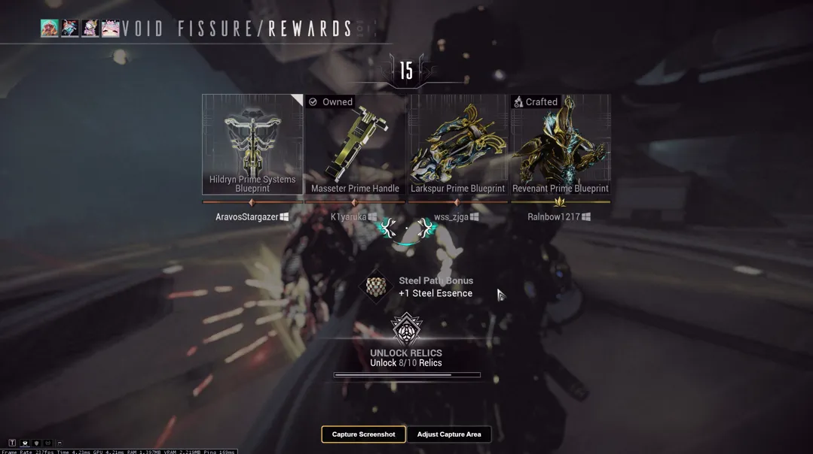
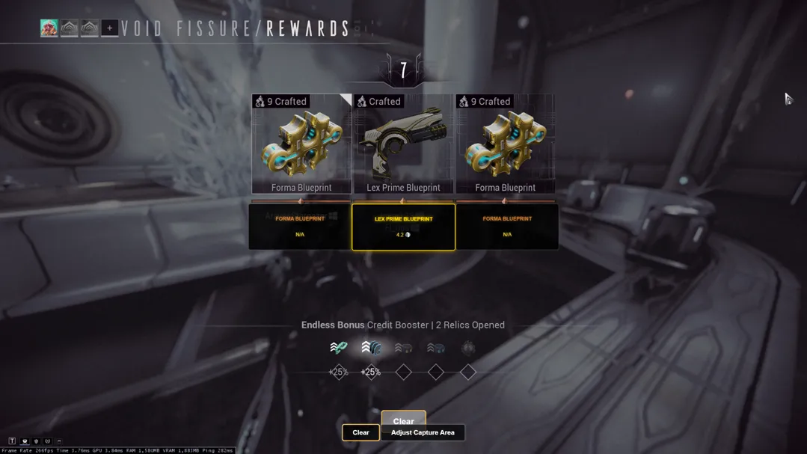
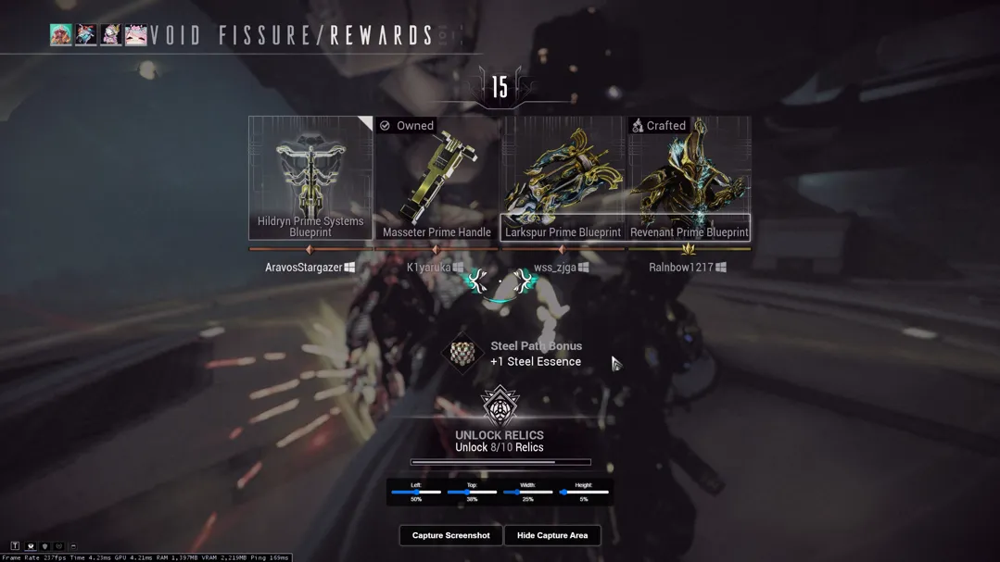
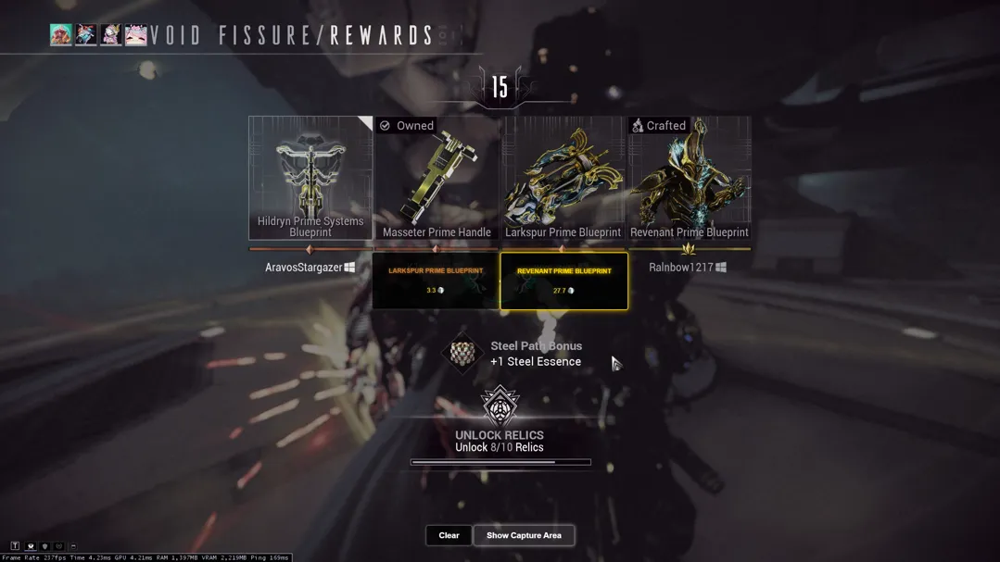
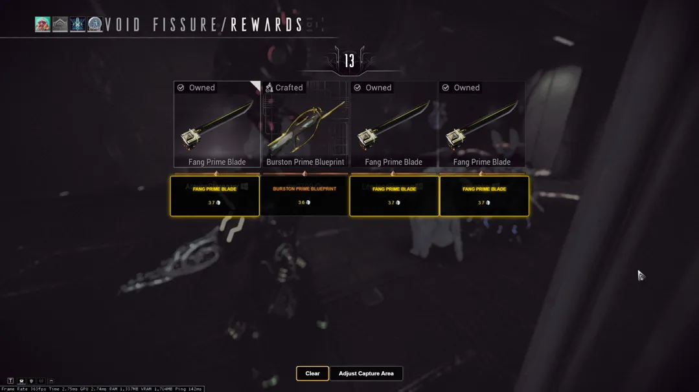

# Warframe Relic Runner

**Warframe Relic Runner** is an overlay tool for Warframe that helps you quickly evaluate the average Platinum value of relic rewards, making it easier to decide which Prime Part to select.

## 📌 Features
- 📸 **Screenshot Capture** – Captures a screenshot when you crack open a relic.
- 🔍 **OCR Extraction** – Uses Tesseract.js to extract text and identify Prime parts.
- 💰 **Market Price Lookup** – Fetches the average market value from Warframe Market.
- ✅ **Informed Decision Making** – Displays Prime Part values on-screen to help you choose the best reward.
- 👥 **Team Support** – Works in solo play or teams of 1–4 players.
- 🎛 **Adjustable Capture Area** – Use slider controls to modify the OCR capture region.
- ⭐ **High-Value Relic Highlighting** – The most valuable relic reward is highlighted in **gold**, while others appear in **bronze**.
- ⚖ **TOS Friendly** – This tool only captures screenshots and does **not** read game memory, making it compliant with Warframe’s Terms of Service.

---

## 🛠 Installation & Setup

### 🔽 Clone the Repository
```sh
git clone https://github.com/Aravos/Warframe-RelicRunner.git
cd Warframe-RelicRunner
```

### 📦 Install Dependencies
```sh
npm install
```

### ▶ Run the Application
```sh
npm run
```

---

## 🎮 Usage Guide
1. **Launch Warframe** as usual.
2. **Open the overlay application.**
3. When you crack open a relic, click **Capture Screenshot** in the overlay.
4. Wait a few seconds for the market values to load on-screen.
5. **Choose the Prime part** based on the displayed Platinum value.
6. **Golden Text = Highest Value Item** 🏆  
   - The **most valuable Prime part** is highlighted with **golden glowing text**.
   - All other relic rewards appear in **bronze text**.
7. Click **Clear** to reset the overlay.
8. **Adjust the Capture Area (Optional)**  
   - Click **Show Capture Area** to reveal the slider controls.
   - Adjust the **Left, Top, Width, and Height** values to refine the OCR region.
   - The overlay updates dynamically to reflect your changes.
9. Repeat the process for each relic.

---

## 🎛 Slider Controls (Capture Area Adjustment)
The overlay includes **four sliders** that let you fine-tune the capture region:

- **Left (%)** – Adjusts the horizontal starting position.
- **Top (%)** – Adjusts the vertical starting position.
- **Width (%)** – Adjusts the width of the capture area.
- **Height (%)** – Adjusts the height of the capture area.

📌 *Sliders are hidden by default. Click **Show Capture Area** to enable them.*

---

<table>
  <tr>
    <th style="text-align:center;">Overlay</th>
    <th style="text-align:center;">Prime Selection</th>
    <th style="text-align:center;">Squad with Forma</th>
  </tr>
  <tr>
    <td></td>
    <td></td>
    <td></td>
  </tr>
</table>

<table>
  <tr>
    <th style="text-align:center;">Select Capture Area</th>
    <th style="text-align:center;">Capture Area</th>
  </tr>
  <tr>
    <td></td>
    <td></td>
  </tr>
</table>

<table>
  <tr>
    <th style="text-align:center;">2-Person Squad</th>
    <th style="text-align:center;">Duplicate Rewards</th>
  </tr>
  <tr>
    <td></td>
    <td></td>
  </tr>
</table>

---
## 🔧 Technologies Used
- ⚡ **Electron.js** – For creating the overlay.
- 🧠 **Tesseract.js** – For Optical Character Recognition (OCR).
- 🖼 **Sharp** – For image processing (cropping, greyscaling, gamma correction).
- 🌐 **Node.js** – Backend processing and file system access.
- 📊 **Warframe Market API** – Fetching real-time Platinum prices.
- 🎨 **HTML, CSS, JavaScript** – Frontend design, user interaction, and slider UI.

---

## 📜 License
This project is licensed under the **MIT License**.